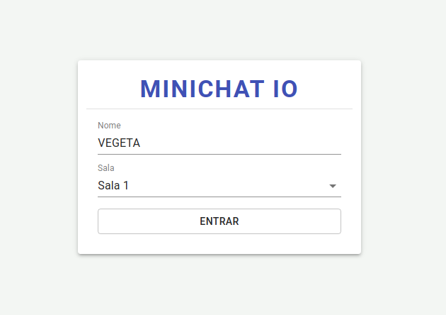
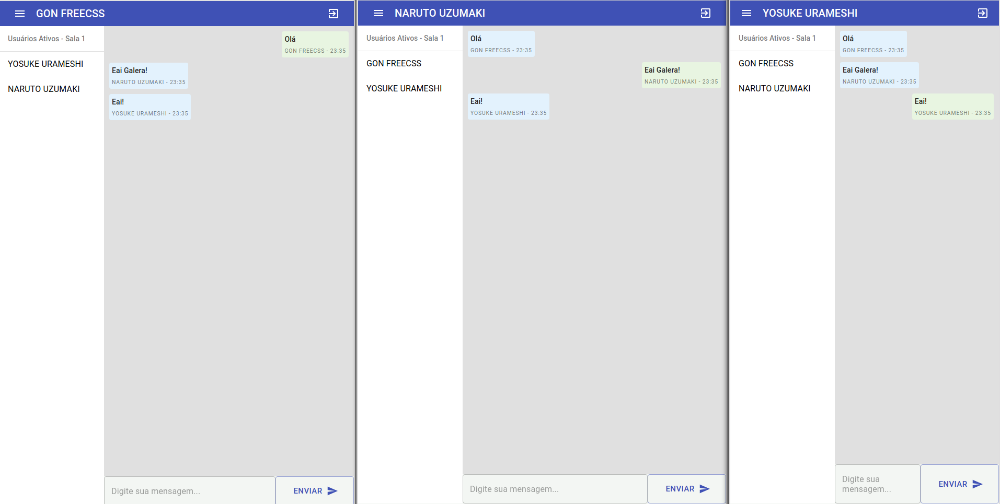

# MINICHAT-IO

Projeto de chat usando ReactJS, Express, Socket.io e Material UI.

## Bibliotecas e Frameworks

- Express
- ReactJs
- Socket IO
- Material-UI
- Notistack

<div style="display: flex; justify-content: space-around">


</div>

## Funcionalidades

- Existem três salas para separação dos chats.
- Notificação de quando um usuário entra ou sai da sala.
- Lista de usuários ativos na sala.

### Execução

**Cliente e Server**

```shell
    yarn start
```

ou

```shell
    npm start
```

### Tela Inicial



### Tela Principal


